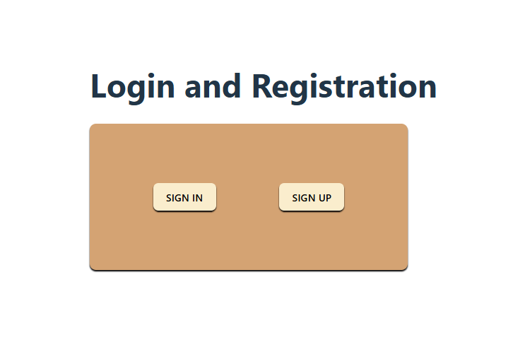
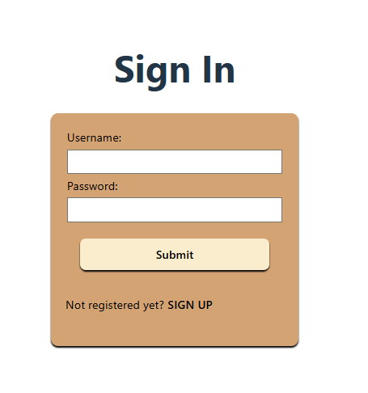
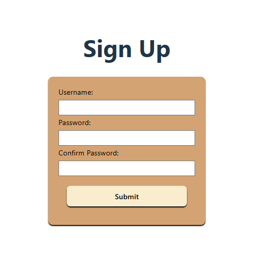

# loginRegistration

This is a MERN stack project for login and registration functionality.

## Technologies Used
- MongoDB (Atlas)
- Express
- React (Vite)
- Node.js

## How to Run

### Backend
1. Go to the `backend` folder.
2. Run `npm install` to install dependencies.
3. Run `node server.js` to start the backend server.

### Frontend
1. Go to the `frontend` folder.
2. Run `npm install` to install dependencies.
3. Run `npm run dev` to start the frontend development server.

## Project Screenshots

## License
MIT
